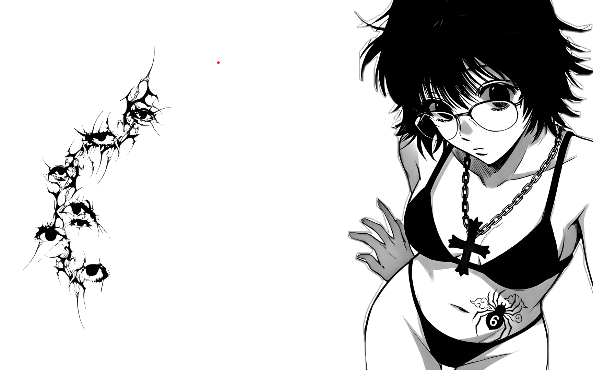

## About

Hi, I'm Rutvik.  
I'm a first-year student currently exploring programming and learning step by step.  
Right now, I work mainly with **Python**, and I’m focused on building a stronger base through practice and curiosity.

## Skills

  

## Shizuku

  

